API de geolocalización y seguridad de direcciones IP (UIDE - Tratamiento de Datos - ej1)

Este proyecto consiste en el diseño, construcción y despliegue de una API funcional utilizando FastAPI, contenedores Docker y despliegue automático en Google Cloud Run.

1. Objetivo del Proyecto
Desarrollar un microservicio capaz de procesar datos de red (IPs) y devolver información geográfica y de seguridad, aplicando buenas prácticas de desarrollo, versionamiento con Git y despliegue en la nube.

2. Tecnologías Utilizadas

- Lenguaje: Python 3.11
- Framework: FastAPI
- Control de Versiones: GitHub (Git Flow con branches)
- Contenerización: Docker
- Infraestructura: Google Cloud (Cloud Run & Artifact Registry)
- Pruebas: curl

3. Gestión de Ramas (Git)
Se aplicó el uso de ramas para el desarrollo de funcionalidades específicas:
main: Código estable para producción.
feature/security-analysis: Rama creada para implementar la lógica de la api con el scoring y validación de IPs.

Comandos utilizados:

- Bash:
git checkout -b feature/security-analysis
git commit -m "first commit"
git checkout main
git merge feature/security-analysis

4. Ejecución Local:

Requisitos previos:

- Python
- Archivo Dockerfile 
- Archivo requirements

Creación imagen docker: docker build -t ejerciciopractico1 .  
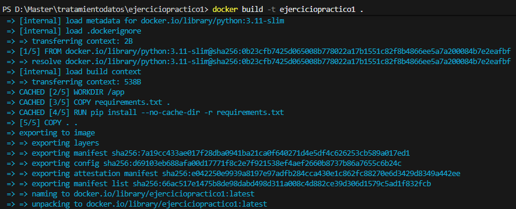
Inicialización contenedor docker: docker run -p 8080:8080 ejerciciopractico1  
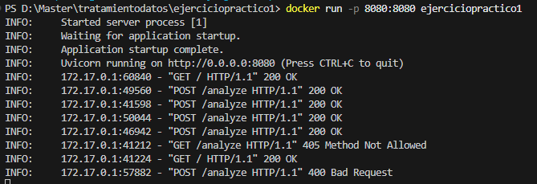
Docker

5. Despliegue en Google Cloud

Despligue Google Cloud Run con sincronización automática al repositorio de github 

Endpoint Público: https://tratamientodatos-ej1-605537504220.us-central1.run.app/

6. Evidencias de Funcionamiento

a. API Funcionando Localmente
- Navegador
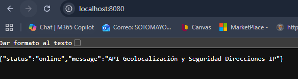
- Curl GET
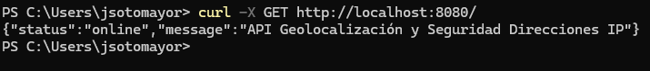
- Curl POST
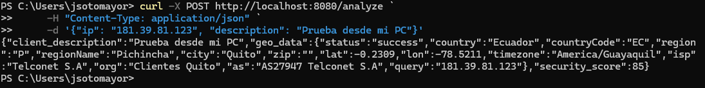

b. API Funcionando con GoogleCloud
- Navegador
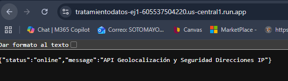
- Curl GET
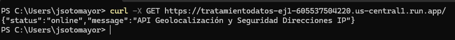
- Curl POST
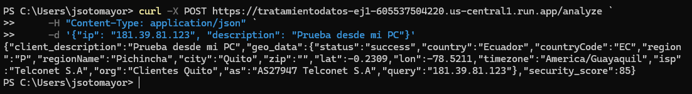

c. Validación de datos
- Local (Colocando una IP inválida)
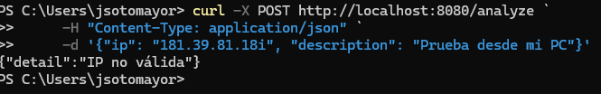
- Google Cloud (Colocando una IP inválida)
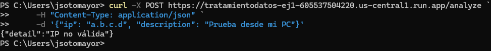

7. Evidencia uso de branchs

- Merge rama feature a main
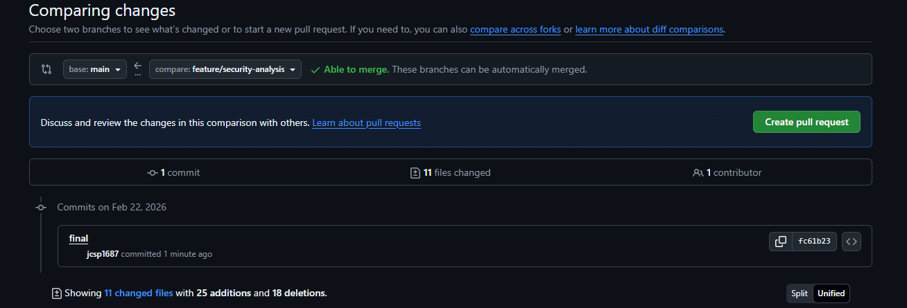
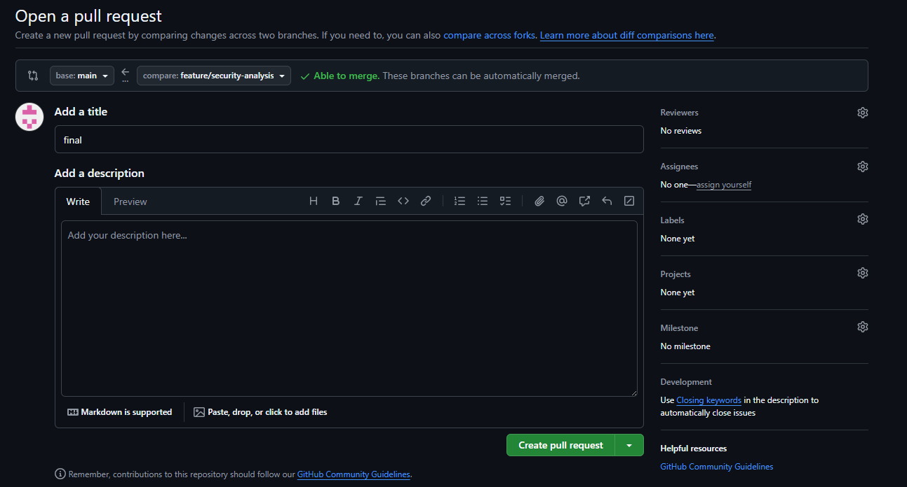
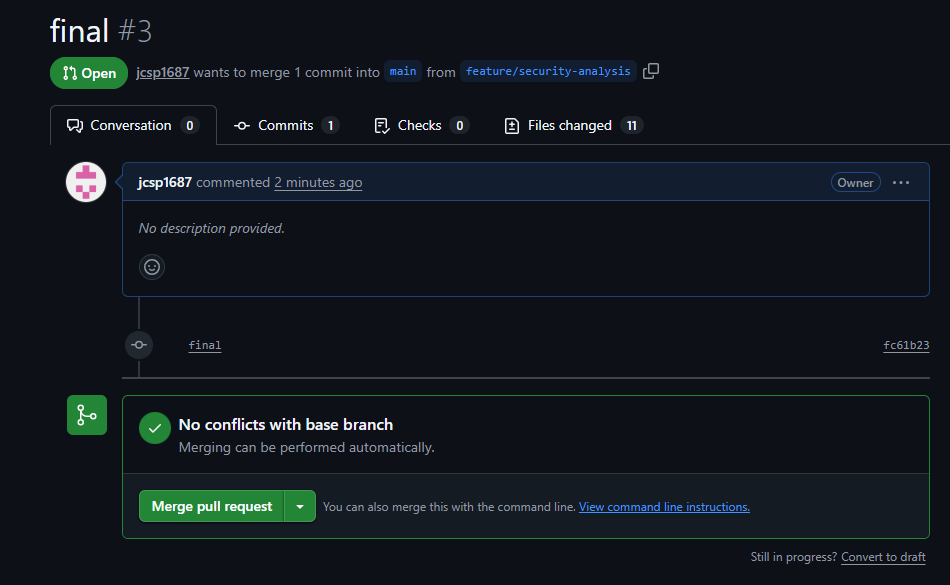
